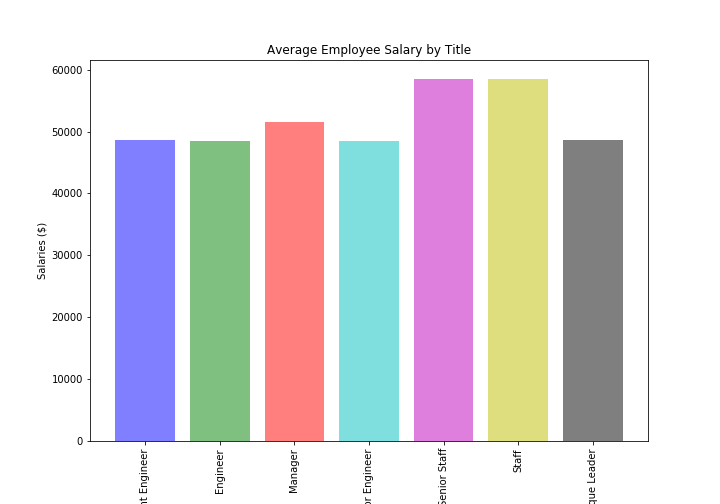

# SQL - Employee Database: A Mystery in Two Parts
SQL Database, Data Engineering,Data Analysis, Data Modeling

## Background

It is a beautiful spring day, and it is two weeks since you have been hired as a new data engineer at Pewlett Hackard. Your first major task is a research project on employees of the corporation from the 1980s and 1990s. All that remain of the database of employees from that period are six CSV files.

You will perform:

1. Data Modeling
2. Data Engineering
3. Data Analysis

Note: You may hear the term "Data Modeling" in place of "Data Engineering," but they are the same terms. Data Engineering is the more modern wording instead of Data Modeling.

#### Data Modeling
Inspect the CSVs and sketch out an ERD of the tables. Feel free to use a tool like QuickDBD

#### Data Engineering

* Use the information you have to create a table schema for each of the six CSV files. Remember to specify data types, primary keys, foreign keys, and other constraints. Be sure to create tables in the correct order to handle foreign keys.

* Import each CSV file into the corresponding SQL table. 

#### Data Analysis

Once you have a complete database, do the following:

1. List the following details of each employee: employee number, last name, first name, sex, and salary.

2. List first name, last name, and hire date for employees who were hired in 1986.

3. List the manager of each department with the following information: department number, department name, the manager's employee number, last name, first name.

4. List the department of each employee with the following information: employee number, last name, first name, and department name.

5. List first name, last name, and sex for employees whose first name is "Hercules" and last names begin with "B."

6. List all employees in the Sales department, including their employee number, last name, first name, and department name.

7. List all employees in the Sales and Development departments, including their employee number, last name, first name, and department name.

8. In descending order, list the frequency count of employee last names, i.e., how many employees share each last name.

## Bonus (Optional)

As you examine the data, you are overcome with a creeping suspicion that the dataset is fake. You surmise that your boss handed you spurious data in order to test the data engineering skills of a new employee. To confirm your hunch, you decide to take the following steps to generate a visualization of the data, with which you will confront your boss:

1. Import the SQL database into Pandas. (Yes, you could read the CSVs directly in Pandas, but you are, after all, trying to prove your technical mettle.) This step may require some research. Feel free to use the code below to get started. Be sure to make any necessary modifications for your username, password, host, port, and database name

2. Create a histogram to visualize the most common salary ranges for employees.

3. Create a bar chart of average salary by title.

