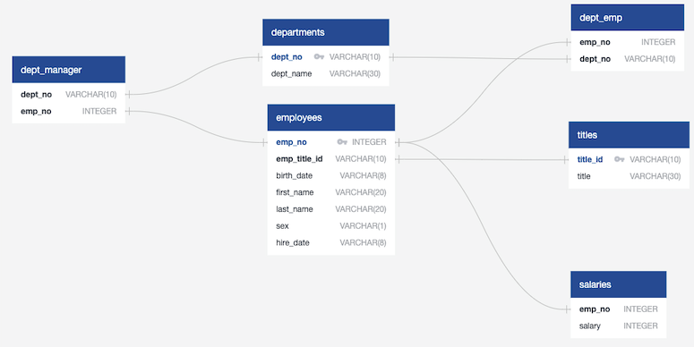

# SQL - Employee Database: A Mystery in Two Parts
SQL Database, Data Engineering,Data Analysis, Data Modeling


## Background

It is a beautiful spring day, and it is two weeks since you have been hired as a new data engineer at Pewlett Hackard. Your first major task is a research project on employees of the corporation from the 1980s and 1990s. All that remain of the database of employees from that period are six CSV files.

You will perform:

1. Data Modeling
2. Data Engineering
3. Data Analysis

Note: You may hear the term "Data Modeling" in place of "Data Engineering," but they are the same terms. Data Engineering is the more modern wording instead of Data Modeling.

## Technologies
* PostgreSQL
* SQLAlchemy
* Python
* Pandas
* Matplotlib
* Numpy
* QuckDBD

## Data Modeling
Inspect the CSVs and sketch out an ERD of the tables. Feel free to use a tool like QuickDBD


## Data Engineering

* Use the information you have to create a table schema for each of the six CSV files. Remember to specify data types, primary keys, foreign keys, and other constraints. Be sure to create tables in the correct order to handle foreign keys.

* Import each CSV file into the corresponding SQL table. 

``` python
-- Data Engineering --
-- Drop Tables if Existing
DROP TABLE IF EXISTS departments;
DROP TABLE IF EXISTS dept_emp;
DROP TABLE IF EXISTS dept_manager;
DROP TABLE IF EXISTS employees;
DROP TABLE IF EXISTS salaries;
DROP TABLE IF EXISTS titles;

-- Exported from QuickDBD: Specifying Data Types, Primary Keys & Foreign Keys 
-- Import CSV Files Into Corresponding SQL Table
CREATE TABLE "titles" (
    "title_id" VARCHAR(10)   NOT NULL,
    "title" VARCHAR(30)   NOT NULL,
    CONSTRAINT "pk_titles" PRIMARY KEY (
        "title_id"
     )
);

CREATE TABLE "departments" (
    "dept_no" VARCHAR(10)   NOT NULL,
    "dept_name" VARCHAR(30)   NOT NULL,
    CONSTRAINT "pk_departments" PRIMARY KEY (
        "dept_no"
     )
);

CREATE TABLE "employees" (
    "emp_no" INTEGER   NOT NULL,
    "emp_title_id" VARCHAR(10)   NOT NULL,
    "birth_date" VARCHAR(8)   NOT NULL,
    "first_name" VARCHAR(20)   NOT NULL,
    "last_name" VARCHAR(20)   NOT NULL,
    "sex" VARCHAR(1)   NOT NULL,
    "hire_date" VARCHAR(8)   NOT NULL,
    CONSTRAINT "pk_employees" PRIMARY KEY (
        "emp_no"
     )
);

CREATE TABLE "dept_manager" (
    "dept_no" VARCHAR(10)   NOT NULL,
    "emp_no" INTEGER   NOT NULL
);

CREATE TABLE "salaries" (
    "emp_no" INTEGER   NOT NULL,
    "salary" INTEGER   NOT NULL
);

CREATE TABLE "dept_emp" (
    "emp_no" INTEGER   NOT NULL,
    "dept_no" VARCHAR(10)   NOT NULL
);

ALTER TABLE "employees" ADD CONSTRAINT "fk_employees_emp_title_id" FOREIGN KEY("emp_title_id")
REFERENCES "titles" ("title_id");

ALTER TABLE "dept_manager" ADD CONSTRAINT "fk_dept_manager_dept_no" FOREIGN KEY("dept_no")
REFERENCES "departments" ("dept_no");

ALTER TABLE "dept_manager" ADD CONSTRAINT "fk_dept_manager_emp_no" FOREIGN KEY("emp_no")
REFERENCES "employees" ("emp_no");

ALTER TABLE "salaries" ADD CONSTRAINT "fk_salaries_emp_no" FOREIGN KEY("emp_no")
REFERENCES "employees" ("emp_no");

ALTER TABLE "dept_emp" ADD CONSTRAINT "fk_dept_emp_emp_no" FOREIGN KEY("emp_no")
REFERENCES "employees" ("emp_no");

ALTER TABLE "dept_emp" ADD CONSTRAINT "fk_dept_emp_dept_no" FOREIGN KEY("dept_no")
REFERENCES "departments" ("dept_no");


-- Query * FROM Each Table Confirming Data
SELECT * FROM departments;
SELECT * FROM titles;
SELECT * FROM employees;
SELECT * FROM dept_emp;
SELECT * FROM dept_manager;
SELECT * FROM salaries;

```
## Data Analysis

Once you have a complete database, do the following:

1. List the following details of each employee: employee number, last name, first name, sex, and salary.
```python
SELECT employees.emp_no, employees.last_name, employees.first_name, employees.sex, salaries.salary
FROM employees
JOIN salaries
ON employees.emp_no = salaries.emp_no;
```

2. List first name, last name, and hire date for employees who were hired in 1986.
```python
SELECT first_name, last_name, hire_date 
FROM employees
WHERE hire_date BETWEEN '1/1/1986' AND '12/31/1986'
ORDER BY hire_date;
```
3. List the manager of each department with the following information: department number, department name, the manager's employee number, last name, first name.
```python 
SELECT departments.dept_no, departments.dept_name, dept_manager.emp_no, employees.last_name, employees.first_name
FROM departments
JOIN dept_manager
ON departments.dept_no = dept_manager.dept_no
JOIN employees
ON dept_manager.emp_no = employees.emp_no;
```

4. List the department of each employee with the following information: employee number, last name, first name, and department name.
```python
SELECT dept_emp.emp_no, employees.last_name, employees.first_name, departments.dept_name
FROM dept_emp
JOIN employees
ON dept_emp.emp_no = employees.emp_no
JOIN departments
ON dept_emp.dept_no = departments.dept_no;
```

5. List first name, last name, and sex for employees whose first name is "Hercules" and last names begin with "B."
```python
SELECT employees.first_name, employees.last_name, employees.sex
FROM employees
WHERE first_name = 'Hercules'
AND last_name Like 'B%'
```
6. List all employees in the Sales department, including their employee number, last name, first name, and department name.
```python
SELECT departments.dept_name, employees.last_name, employees.first_name
FROM dept_emp
JOIN employees
ON dept_emp.emp_no = employees.emp_no
JOIN departments
ON dept_emp.dept_no = departments.dept_no
WHERE departments.dept_name = 'Sales';
```

7. List all employees in the Sales and Development departments, including their employee number, last name, first name, and department name.
```python
FROM dept_emp
JOIN employees
ON dept_emp.emp_no = employees.emp_no
JOIN departments
ON dept_emp.dept_no = departments.dept_no
WHERE departments.dept_name = 'Sales' 
OR departments.dept_name = 'Development';
```

8. In descending order, list the frequency count of employee last names, i.e., how many employees share each last name.
```python
SELECT last_name,
COUNT(last_name) AS "frequency"
FROM employees
GROUP BY last_name
ORDER BY
COUNT(last_name) DESC;
```

## Bonus (Optional)

As you examine the data, you are overcome with a creeping suspicion that the dataset is fake. You surmise that your boss handed you spurious data in order to test the data engineering skills of a new employee. To confirm your hunch, you decide to take the following steps to generate a visualization of the data, with which you will confront your boss:

1. Import the SQL database into Pandas. (Yes, you could read the CSVs directly in Pandas, but you are, after all, trying to prove your technical mettle.) This step may require some research. Feel free to use the code below to get started. Be sure to make any necessary modifications for your username, password, host, port, and database name


2. Create a histogram to visualize the most common salary ranges for employees.


3. Create a bar chart of average salary by title.


## Epilogue

Evidence in hand, you march into your boss's office and present the visualization. With a sly grin, your boss thanks you for your work. On your way out of the office, you hear the words, "Search your ID number." You look down at your badge to see that your employee ID number is 499942.
```python
my_id=combined_data2[combined_data2['emp_no']==499942]
my_data=my_id[['emp_no','title','first_name','last_name','salary','hire_date']]
my_data
my_data.columns=['emp_no','title','first_name','last_name','salary ($)','hire_date']
my_data
```

